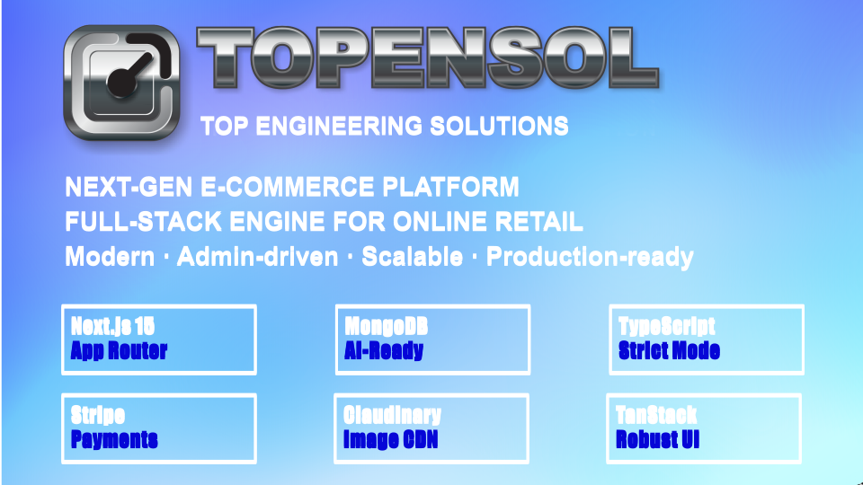
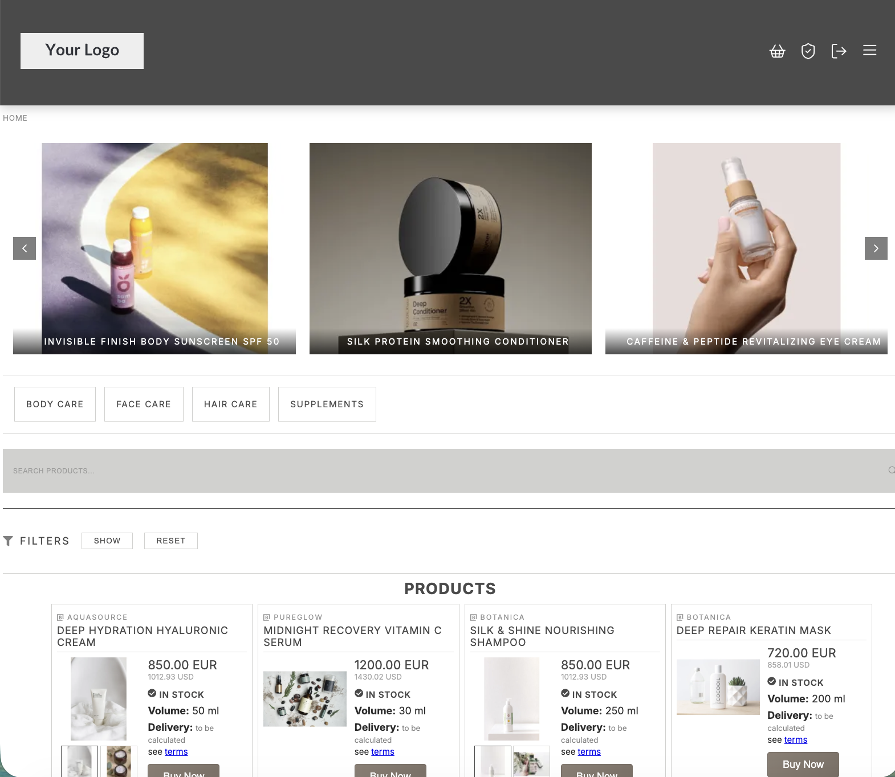
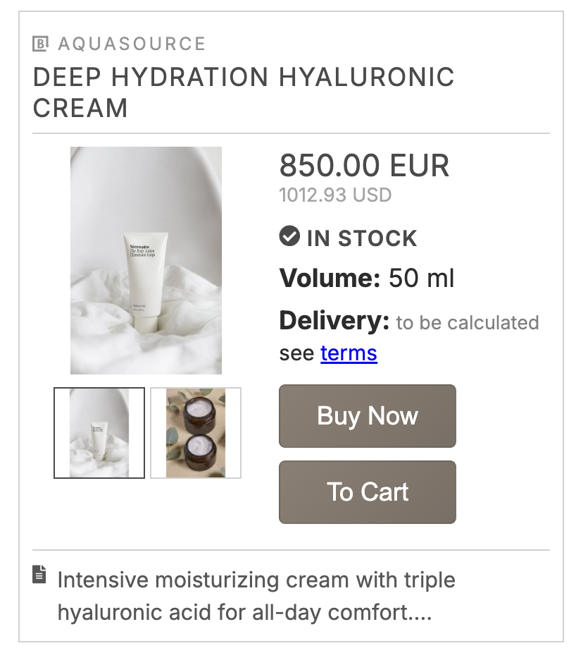
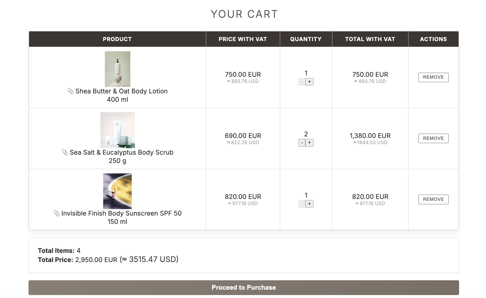
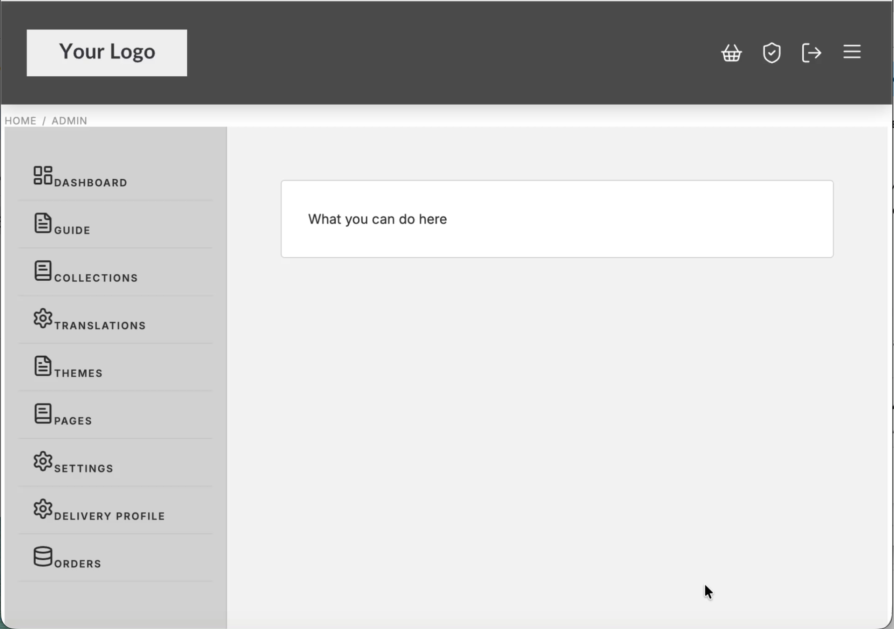
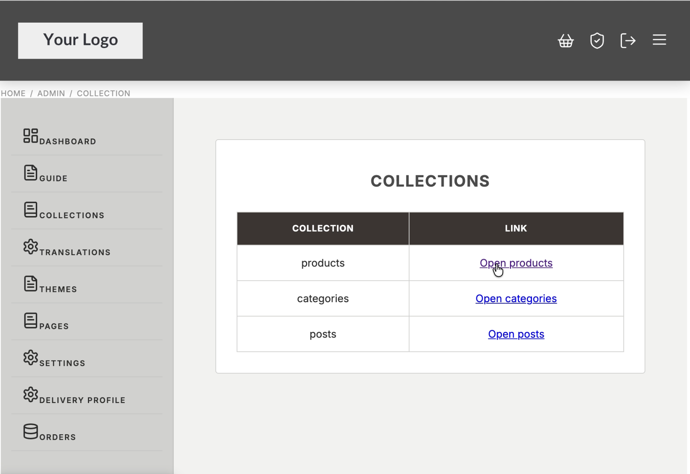
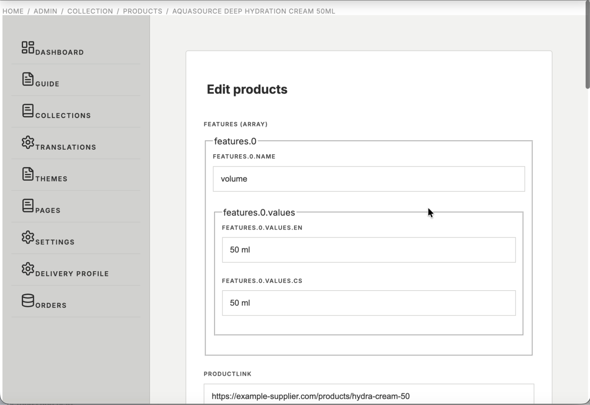

# next-e-commerce — Full-Stack E-Commerce Platform

**Production-ready. Admin-driven. Built to scale.**

A complete e-commerce platform built on Next.js 15, TypeScript, and MongoDB — with a real admin panel, real checkout, real auth, and real order management. Deploy and start selling on day one.

-----

## Built With

|Layer       |Technology                                                              |
|------------|------------------------------------------------------------------------|
|Framework   |**Next.js 15** — App Router, Server Components by default               |
|Language    |**TypeScript** — strict mode                                            |
|UI          |**React 19** — native CSS Modules                                       |
|Database    |**MongoDB + Mongoose** — Atlas or self-managed                          |
|Auth        |**NextAuth.js v5** — Google OAuth + Magic Link (passwordless only)      |
|State       |**TanStack React Query v5**                                             |
|Payments    |**Stripe** — redirect-based checkout                                    |
|Images      |**Cloudinary** — custom Next.js loader with auto-optimization           |
|Email + PDF |**Nodemailer + pdf-lib** — transactional emails with invoice attachments|
|i18n        |**next-i18n-router + react-intl** — locale-prefixed routing             |
|Order Engine|**WooCommerce REST API** — headless order engine                        |
|Testing     |**Playwright** — E2E tests for all critical user flows                  |
|Security    |**Zod + DOMPurify + CSP nonce** + Cloudflare WAF (recommended)          |
|Monitoring  |**Sentry**                                                              |

-----

## Why This Stack

### Performance & SEO by Default

Next.js 15 Server Components minimize client-side JavaScript. Pages load fast without manual optimization. Dynamic metadata, JSON-LD structured data, automatic sitemap generation, and 410 redirects on product deletion are built in from day one — not bolted on later.

### MongoDB Is AI-Ready

Vector Search is available natively in MongoDB Atlas. The platform is already structured to add semantic product discovery and an AI shopping assistant without any architectural changes.

### Multi-Tenant Ready

The architecture already supports isolated storefronts with separate admin panels and separate data. Extending to a SaaS model requires no structural changes.

-----

## What’s Included

### Storefront

- Responsive design — fluid adaptation across all screen sizes
- Product catalog with dynamic filtering: categories, subcategories, brand, and admin-defined custom filters (configured in the admin panel, no code changes)
- Full-text search — when active, overrides all other filters
- Product cards with variant switching — clicking a thumbnail updates the main image, price, stock status, and the detail page link without navigation
- Product detail page with variant gallery, matching products carousel, and tabbed product info
- Cookie consent banner with GTM integration

### Cart & Checkout

- Cart stored in MongoDB — persists for 5 days (TTL index)
- One active cart per device; guest and authenticated carts handled separately
- Smart cart sync on login: authenticated user’s cart takes priority; guest cart is attached to the account if no saved cart exists
- 5-step checkout: cart → shipping address → billing & payment → Stripe → confirmation
- Buy Now — bypasses cart, goes directly to checkout
- Guest checkout with email verification
- Stripe redirect-based payment
- Cash on delivery support (configurable per country)
- PDF invoice generated server-side and sent by email on order completion

### Order Management

- Completed orders moved from `preorders` to a dedicated `orders` collection in MongoDB — retained for 6 months
- Order visibility in customer profile determined by **Billing email**
- Customer profile: order history with status tracking, downloadable invoices

### Admin Panel (`/admin`)

- **Collections** — CRUD for Products, Categories, and Posts with drag-resizable columns, bulk operations, and bidirectional WooCommerce sync
- **Import / Export** — XLSX and JSON, differential algorithm (create / update / delete), safe to retry
- **Translations** — edit all UI text without rebuilding; organized by component
- **Themes** — JSON-based theme editor; switch active theme site-wide instantly
- **Pages** — create and manage static pages (Markdown); assign to header or footer
- **Settings** — languages, currencies, brand, custom filters (Enums), integrations, social links, invoice data
- **Delivery Profiles** — per-country rules with weight-based or price-based calculation, free shipping thresholds, COD surcharges, per-country discounts
- **Built-in Guide** — documentation embedded in the admin panel

### Auth & Security

- Passwordless only: Google OAuth + Magic Link. No stored passwords
- Role-based access: `client` and `admin`. Admin role assigned via direct MongoDB edit only (no UI promotion — by design)
- Middleware pipeline: i18n routing → IP filtering → keyword filtering → route protection → CSP nonce generation
- Zod validation on all API inputs; DOMPurify sanitization on all rendered content
- Cloudflare WAF recommended as perimeter; rate limiting configurable via Upstash Redis

### SEO & Discoverability

- `generateMetadata()` on all pages — dynamic titles, descriptions, Open Graph
- JSON-LD structured data: Organization, BlogPosting, FAQPage, Review, BreadcrumbList
- Automatic `sitemap.xml` and `robots.txt` generation
- 410 Gone redirects created automatically on product, category, or post deletion — preserving crawl budget
- Google Shopping XML feed (token-protected)
- Google reCAPTCHA on the contact form

### i18n

- Every route is locale-prefixed
- Supported languages managed in the admin panel — no code changes to add a language
- All product names, descriptions, features, filter labels, and UI text support localized values

-----

## WooCommerce Integration

WooCommerce is a **built-in part of the architecture**, not an optional add-on.

- Orders are written to WooCommerce at checkout for fulfilment and status tracking
- Order status is read live from WooCommerce in the customer profile
- The full order payload is always saved in MongoDB simultaneously — primary long-term store

The integration exists because many regional shipping carriers have ready-made WooCommerce plugins — connecting a carrier takes minutes instead of building a custom integration from scratch.

-----

## Testing

### Test files

|File                            |Coverage                                                  |
|--------------------------------|----------------------------------------------------------|
|`tests/home.spec.ts`            |Smoke — homepage loads and renders                        |
|`tests/product.spec.ts`         |Product page loads and displays expected elements         |
|`tests/cart.spec.ts`            |Add / remove, quantity controls, persistence across reload|
|`tests/checkout.cart.spec.ts`   |Cart → shipping → billing flow                            |
|`tests/checkout.buy_now.spec.ts`|Buy Now → shipping → billing flow                         |
|`tests/db/db.spec.ts`           |Product CRUD — create, update, delete via Mongoose ⚠️      |
|`tests/db/delivery.spec.ts`     |Delivery profile reflected on shipping page ⚠️             |

> ⚠️ Database tests write to the database. Run them only against a local or dedicated test instance — never against production.

-----

## Requirements

- Node.js ≥ 18.0.0
- MongoDB (local or Atlas)
- See `README.md` for full environment variable reference

-----

## License

This project is proprietary and not open‑source.

All rights reserved.  
You may not copy, modify, distribute, or use any part of this project  
without explicit written permission from the author.

-----

*next-e-commerce — production-ready from day one, built to grow.*
